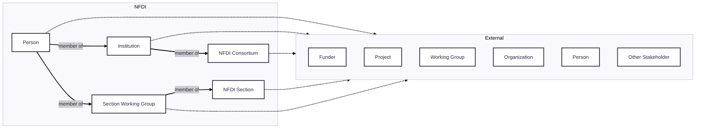

# Section International Engagement Working Group on Landscaping and Outreach

Links:

- [Rolling Agenda](https://docs.google.com/document/d/1kvNkhYTdnMuBjMOZS5RcwXZa1xCi57heHeRf9VbQIbw/edit?usp=sharing)
- [RocketChat](https://go.rocket.chat/invite?host=all-chat.nfdi.de&path=invite%2FsJ8Gdy)
- [Working Group Mailing List](https://lists.nfdi.de/postorius/lists/section-int-wg-landscape.lists.nfdi.de)

## Diagram

## License

Code in this repository is licensed under MIT.
Data in this repository are licensed under CC0.
