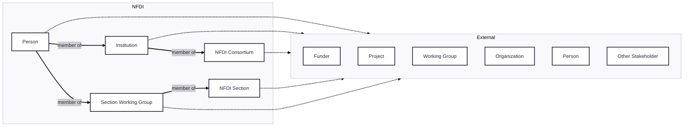

# Section International Engagement Working Group on Landscaping and Outreach

```mermaid
---
config:
      theme: redux
---
graph LR
    
    internalPerson[Person] -.-> external
    internalInstitution[Institution] -.->  external
    internalConsortium[NFDI Consortium] -.-> external
    internalSection[NFDI Section] -.-> external
    internalWG[Section Working Group] -.-> external

    subgraph external [External]
        funder[Funder]
        project[Project]
        workingGroup[Working Group]
        organization[Organization]
        externalPerson[Person]
        externalOther[Other Stakeholder]
    end

    subgraph internal [NFDI]
        internalPerson -- member of --> internalInstitution -- member of --> internalConsortium
        internalPerson -- member of --> internalWG -- member of --> internalSection
    end
```
