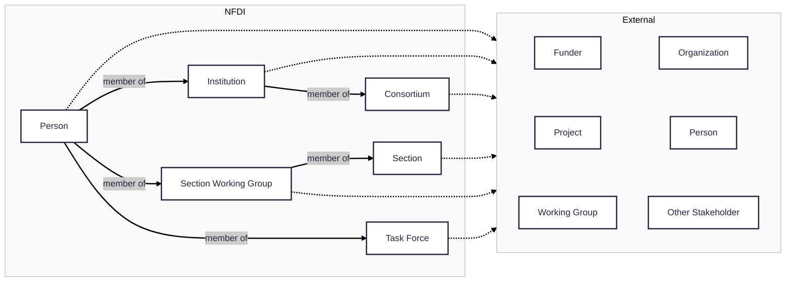

# Section International Engagement Working Group on Landscaping and Outreach

Meetings take place on the first Wednesday of each month at 11AM German time.

Important links:

- [RocketChat](https://go.rocket.chat/invite?host=all-chat.nfdi.de&path=invite%2FxCPL47)
- [Mailing List](https://lists.nfdi.de/postorius/lists/section-int-wg-landscape.lists.nfdi.de)
- Charter
  - [source code](charter/)
  - [Zenodo publication](https://doi.org/10.5281/zenodo.21420211)

If you're interested to join, either open an issue
(https://github.com/nfdi-de/section-int-wg-landscape/issues/new) or join our
RocketChat channel to say hello and we will forward the agenda and Zoom link.

## Diagram

```mermaid
---
config:
      theme: redux
---
graph LR

    internalPerson[Person] -.-> external
    internalInstitution[Institution] -.->  external
    internalConsortium[Consortium] -.-> external
    internalSection[Section] -.-> external
    internalWG[Section Working Group] -.-> external
    internalTF[Task Force] -.-> external

    subgraph external [External]
        funder[Funder]
        project[Project]
        workingGroup[Working Group]
        organization[Organization]
        externalPerson[Person]
        externalOther[Other Stakeholder]

        funder ~~~ project ~~~ workingGroup
        organization ~~~ externalPerson ~~~ externalOther

    end

    subgraph internal [NFDI]
        internalPerson -- member of --> internalInstitution -- member of --> internalConsortium
        internalPerson -- member of --> internalWG -- member of --> internalSection
        internalPerson -- member of --> internalTF
    end
```

## License

Code in this repository is licensed under MIT. Data in this repository are
licensed under CC0.
