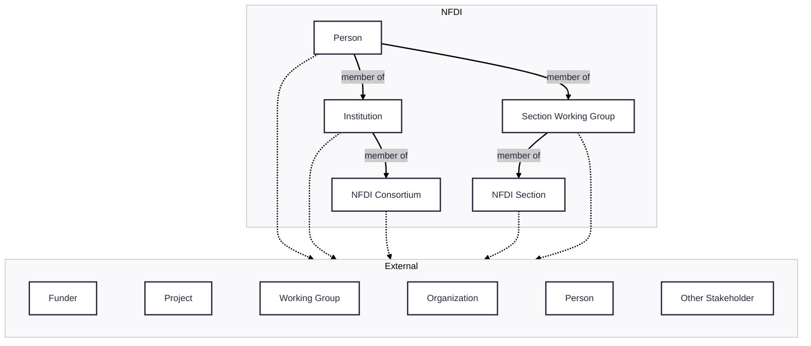

# Section Internationalization Working Group for Landscaping and Outreach Charter

## Background

NFDI Section International Engagement was established in March 2026 to support
the NFDI, its affiliates, and its researchers in _internationalization_ - the
process of identifying and executing outreach, collaboration, and communication
with European and international partners (e.g., working groups, projects,
organizations, funders, other stakeholders).

**Figure S1.** A schematic diagram of the architecture of external interactions.

Internationalization has the benefits of fostering collaboration, deduplicating
effort, accruing international recognition, and creating opportunities for
international funding. However, it also presents three key challenges:

1. Interacting with larger European and international partners often requires
   addressing complicated and sometimes vague requirements, navigating
   unfamiliar bureaucracy, and understanding socio-historical context.
2. European and international collaborations, despite their importance, are
   often under- or unfunded, necessitating principled prioritization of in-kind
   contributions and careful time management.
3. Navigating the complex landscape of national, and international entities is
   overwhelming, especially when onboarding new individuals to the NFDI

# Goals

The primary goals of NFDI Section Internationalization Working Group for
Landscaping and Outreach (_WG Landscape_) are to address the previously stated
challenges by organizing information about the European and international
landscapes relevant for NFDI consortia, developing tools and training materials
to support NFDI consortia in internationalization, and to support NFDI Section
Internationalization's working groups (and where possible, other sections'
working groups) in the execution of internationalization opportunities, such as,
but not limited to, the [European Open Science Cloud (EOSC)](https://eosc.eu).
These activities fall under two larger goals:

### Goal 1

The first goal is to identify existing and aspirational interactions between
NFDI (on the individual, organization, and consortium level) and relevant
European and international entities (e.g., working groups, projects,
organizations, funders, infrastructures, and other stakeholders). We aim to
contextualize each interaction with its type (e.g., collaboration, delivery of
work), the actors within NFDI that mediate the interaction, the goals and
benefits of the interaction, and the inputs/outputs of the interaction. For each
European and international entity, we also aim to identify the data standards on
which it works and activities in which it participates.

### Goal 2

The second goal is to develop tools for accessing, summarizing, exploring,
querying, and using the landscape, for example, into a workflow that prioritizes
relevant external entities for NFDI to interact with, summarizes the purpose and
important context of such an interaction, and identifies the appropriate
individuals or groups within NFDI to mediate the interaction. Such tools will
also support NFDI consortia in identifying and avoiding duplication of effort
with existing international activities.

### Non-goals

This working group does not have the goal to directly execute outreach to
external working groups, projects, organizations, funders, infrastructures, and
other stakeholders. These goals will be owned by Section Int working group 3,
tentatively entitled _WG Continuation_.

## Tasks

### Task 1

Assemble previous reporting materials and known efforts similar to this WG. We
will use previous reporting material and documentation as a seeding point such
as:

1. Interim reports to the DFG, Proposals for each consortium (both phase 1 and
   2), Konsortialversammlung, and other consortium documents
2. Section concepts and working group charters
3. NFDI strategy documents

We will leverage our network to collect such materials from the consortium
coordinators and consolidate metadata about them in structured artifacts (e.g.,
spreadsheets). We will also consider proactively interviewing knowledgeable
individuals (e.g., consortium speakers). Importantly, we will note which
information is public and which is private.

### Task 2

Develop and deploy a survey to send to each NFDI consortium that will inquire
about relevant external entities (e.g., projects, organizations) and collect
relevant context. We will align with pre-existing vocabulary used in the
[Collaborative Work in NFDI](https://zenodo.org/records/15880071) document.

### Task 3

Send the survey to all NFDI consortia and partners. The estimated runtime is two
months, during which, advertize across various communication channels to promote
participation.

In parallel, we will enable NFDI members to quickly report information about new
external organizations that they're interested in as an ongoing effort. WG
Landscape could then proactively follow-up on these requests. WG Landscape will
also proactively search for new potential interactions as an as-needed ongoing
background activity.

### Task 4

We will develop a semi-automated workflow for standardizing the survey results
(e.g., to make them findable, accessible, interoperable, and reusable (FAIR))
and enriching them (e.g., to connect to both internal and external knowledge
graphs). We aspire to leverage bibliometric resources (funding indexes like
[CORDIS](https://cordis.europa.eu), literature indexes like
[PubMed](https://pubmed.ncbi.nlm.nih.gov), project indexes like
[NIH RePORTER](https://reporter.nih.gov/), organization registries like the
[Research Organization Registry (ROR)](https://ror.org)) to complement and
enrich NFDI information.

### Task 5

Develop reusable analytical workflows and produce reporting materials
appropriate for NFDI stakeholders and new NFDI consortium members answering key
questions. Present these reports at NFDI Consortia Assembly and NFDI Scientific
Senate meetings.

Reporting materials for NFDI stakeholders and new NFDI consortium members will
answer key questions such as:

- Are there gaps in our external activities? What are other countries doing on
  the national level?
- How do we prioritize contributing to existing activities and creating new
  ones?
- How can we communicate the importance of external interaction besides through
  the lens of funding? For example, what are the scientific, philosophical, and
  societal impacts of external interactions?
- How can we classify interactions based on the topics that they're incident to?

Potential avenues of publication:

- An interaction matrix between NFDI consortia and external entities, entrance
  point to making more clever filtering, interactivity (e.g., as a website).
- A white paper that highlights key existing and aspirational interactions, such
  as with EOSC and the
  [Research Data Alliance (RDA)](https://www.rd-alliance.org)
- A knowledge graph that can be federated and queried with other NFDI knowledge
  graphs, in collaboration with the Base4NFDI service _KGI4NFDI_

### Task 6

Repeat the activities in **Tasks 3-5** on a yearly basis and include additional
year-over-year reporting.

## Work Plan

The initial work plan for WG Landscape provides a relaxed timeline for
addressing the first five tasks during the first year of activity:

- 2026 Q3/4 - Tasks 1 and 2
- 2027 Q1 - Task 3 and 4
- 2027 Q2 - Task 4
- 2027 Q3 - Task 5

## Governance

### Meetings and Communication

The WG meets on the first Wednesday of each month at 11.00 (German time).
Communication is primarily through
[RocketChat](https://go.rocket.chat/invite?host=all-chat.nfdi.de&path=invite%2FsJ8Gdy).
There are no membership requirements and meetings are open to anyone who would
like to join. Minutes will be taken on a public document.

### Openness

WG Landscape will follow the
[Open Data, Open Code, Open Infrastructure (O3) guidelines](https://doi.org/10.1038/s41597-024-03406-w)
to make all outputs (e.g., code, data, documentation) open via a public
repository on GitHub within the
[NFDI organization](https://github.com/nfdi-de/section-int-wg-landscape), except
in cases when dealing with internal NFDI documents.

### Charter as a Living Document

WG Landscape's charter is a living document, whose source code lives on the
working group's GitHub repository
[https://github.com/nfdi-de/section-int-wg-landscape](https://github.com/nfdi-de/section-int-wg-landscape).
Improvements to the charter can be made and reviewed asynchronously as pull
requests, avoiding the need for long discussions during infrequent WG Landscape
meetings. The working group will decide on an _ad hoc_ basis when to make new
releases (i.e., post new versions) to Zenodo.

## Initial Membership List

WG Landscape's initial membership list is open to anyone who is interested in
the goals of the WG, regardless of whether they have been able to attend the
initial meetings.

| Name                 | ORCiD                                                        | Organizations    | Email                                                                   |
| :------------------- | :----------------------------------------------------------- | :--------------- | :---------------------------------------------------------------------- |
| Sebastian Böhm       | [0009-0006-4599-6309](https://orcid.org/0009-0006-4599-6309) | NFDI4Immuno      | [sebastian.boehm@fli.de](mailto:sebastian.boehm@fli.de)                 |
| Alexandra Büttner    | [0000-0002-4950-0941](https://orcid.org/0000-0002-4950-0941) | NFDI4Culture     | [alexandra.buettne@adwmainz.de](mailto:alexandra.buettne@adwmainz.de)   |
| Cordula Hege         | [0000-0003-0616-5191](https://orcid.org/0000-0003-0616-5191) | Base4NFDI        | [cordula.hege@desy.de](mailto:cordula.hege@desy.de)                     |
| Charles Tapley Hoyt† | [0000-0003-4423-4370](https://orcid.org/0000-0003-4423-4370) | NFDI4Chem        | [charles.hoyt@ac.rwth-aachen.de](mailto:charles.hoyt@ac.rwth-aachen.de) |
| Melina Jander        | [0000-0003-1646-6836](https://orcid.org/0000-0003-1646-6836) | Text+, Base4NFDI | [jander@sub.uni-goettingen.de](mailto:jander@sub.uni-goettingen.de)     |
| Alicja Krysmann      | [0000-0003-1353-0994](https://orcid.org/0000-0003-1353-0994) | NFDI4Immuno      | [alicja.krysmann@fli.de](mailto:alicja.krysmann@fli.de)                 |
| Peter Mutschke       | [0000-0003-3517-8071](https://orcid.org/0000-0003-3517-8071) | KonsortSWD       | [peter.mutschke@gesis.org](mailto:peter.mutschke@gesis.org)             |
| Janete Saldanha Bach | [0000-0001-9011-5837](https://orcid.org/0000-0001-9011-5837) | KonsortSWD       | [janete.saldanhabach@gesis.org](mailto:janete.saldanhabach@gesis.org)   |
| Thomas Schörner      | [0000-0002-7213-0352](https://orcid.org/0000-0002-7213-0352) | PUNCH4NFDI       | [thomas.schoerner@desy.de](mailto:thomas.schoerner@desy.de)             |
| Christiane Schneide  | [0000-0003-1024-6875](https://orcid.org/0000-0003-1024-6875) | PUNCH4NFDI       | [christiane.schneide@desy.de](mailto:christiane.schneide@desy.de)       |
| Robert Ulrich        | [0000-0001-9063-2703](https://orcid.org/0000-0001-9063-2703) | re3data          | [robert.ulrich@kit.edu](mailto:robert.ulrich@kit.edu)                   |
| Alois Wieshuber      | [0009-0001-7010-7968](https://orcid.org/0009-0001-7010-7968) | Base4NFDI        | [alois.georg.wieshuber@desy.de](mailto:alois.georg.wieshuber@desy.de)   |

†WG lead

## Connection to other NFDI groups

Besides the need to connect with all NFDI groups to collect information, we
envision overlap and collaboration with:

- Section Industry WG Cooperation
- Section Int WG EOSC
- Section EduTrain Networking and Outreach
- Section EduTrain RDM Helpdesk Working Group
- Section Meta WG Knowledge Graphs

# Connection to other external groups and projects

- [Community Research and Development Information Service (CORDIS)](https://cordis.europa.eu)
- [European Strategy Forum on Research Infrastructures (ESFRI)](https://research-and-innovation.ec.europa.eu/strategy/strategy-research-and-innovation/our-digital-future/european-research-infrastructures/esfri_en)
- [Research Organization Registry (ROR)](https://ror.org)
- [Wikidata](https://www.wikidata.org/wiki/Wikidata:Main_Page)
- [European Open Science Cloud (EOSC)](https://open-science-cloud.ec.europa.eu)
